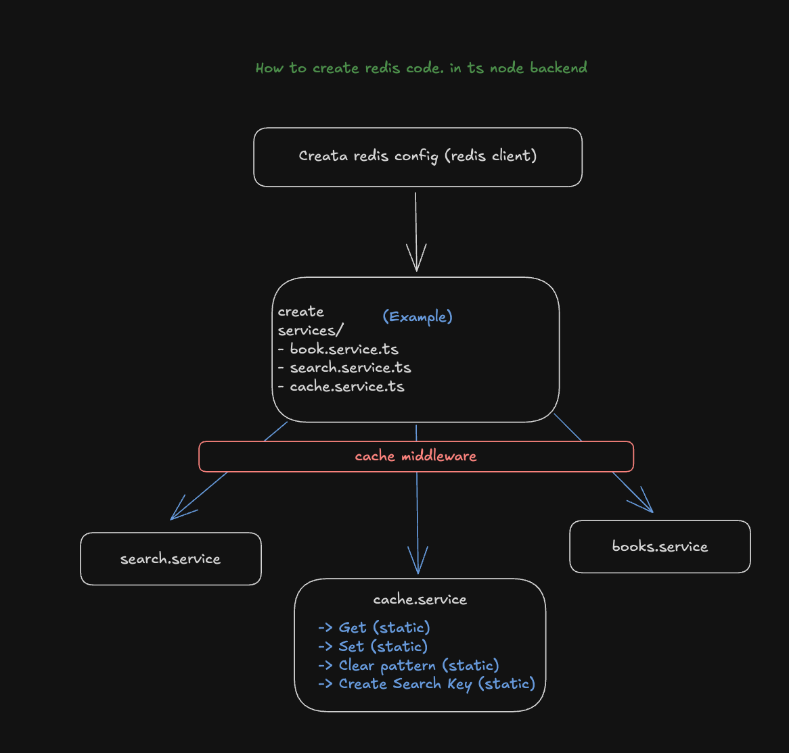

# BookSwap - Connect, Share, Read 📚

[](https://opensource.org/licenses/MIT)
[](https://nodejs.org/)
[](https://reactjs.org/)
[](https://www.docker.com/)
[](https://www.typescriptlang.org/)

## 🌟 Live Demo

Visit the application: [books.yashprojects.online](https://books.yashprojects.online)


## 📋 Overview

BookSwap is a modern platform connecting book enthusiasts to share, rent, and exchange books. Built with a focus on user experience and performance, it facilitates seamless interactions between book owners and seekers through an intuitive interface.

### Key Features

- 📝 User profiles with role-based permissions (Book Owners & Seekers)
- 📚 Comprehensive book listing management
- 🔒 Secure JWT authentication
- 🔍 Advanced search with Redis caching
- 📷 AWS S3 integration for image uploads
- 🔄 Real-time status updates for book availability

## 🛠️ Technology Stack

### Frontend
- **React.js** - UI library
- **Next.js** - React framework
- **Tailwind CSS** - Utility-first CSS framework
- **TypeScript** - Type safety
- **ShadcnUI** - Component library

### Backend
- **Node.js** - JavaScript runtime
- **Express** - Web framework
- **PostgreSQL** - Relational database
- **Prisma** - ORM for database operations
- **Redis** - Caching for search results
- **JWT** - Authentication

### Infrastructure
- **Docker** - Containerization
- **AWS EC2** - Cloud hosting
- **AWS S3** - Image storage
- **Nginx** - Reverse proxy
- **Cloudflare** - SSL/TLS and CDN

## 🏗️ Architecture

The application follows a monolithic architecture with clear separation of concerns:

```
BookSwap
├── Frontend (Next.js)
│   ├── Public UI
│   ├── Owner Dashboard
│   ├── Seeker Dashboard
│   └── Authentication
│
├── Backend (Node.js/Express)
│   ├── API Routes
│   ├── Authentication Service
│   ├── Book Service
│   ├── User Service
│   └── S3 Service
│
└── Database Layer
    ├── PostgreSQL (primary data)
    └── Redis (caching)
```

## 🚀 Getting Started

### Prerequisites
- [Docker](https://www.docker.com/) and [Docker Compose](https://docs.docker.com/compose/)
- [Node.js](https://nodejs.org/) v18+ (for local development)
- [npm](https://www.npmjs.com/) or [yarn](https://yarnpkg.com/)
- AWS account with S3 bucket (for image uploads)

### Environment Setup

1. Clone the repository
   ```bash
   git clone https://github.com/yourusername/bookswap.git
   cd bookswap
   ```

2. Configure environment variables
   ```bash
   # Backend (.env file in be directory)
   cp be/.env.example be/.env
   # Edit be/.env with your database, Redis and AWS credentials

   # Frontend (.env file in fe directory)
   cp fe/.env.example fe/.env
   # Edit fe/.env with your API URL
   ```

3. Run with Docker Compose

   **Backend Only:**
   ```bash
   cd be
   docker-compose up -d
   ```

   **Frontend Only:**
   ```bash
   cd fe
   docker-compose up -d
   ```

   **Complete Stack:**
   ```bash
   # From project root
   docker-compose up -d
   ```

4. Access the application
   - Frontend: http://localhost:3000
   - Backend API: http://localhost:3001

### Local Development

For a standard local development setup:

```bash
# Backend
cd be
npm install
npm run dev

# Frontend
cd fe
npm install
npm run dev
```

## 🔍 Features In-Depth

### User Management
- Registration with role selection
- Profile management
- Secure authentication
- Role-based access control

### Book Management
- Create, read, update, delete book listings
- Image upload with S3 integration
- Status toggles (available/unavailable)
- Owner-specific operations

### Search System


Our search functionality offers:
- Redis-cached results for performance
- Multi-criteria filtering
- Location-based searching
- Genre categorization

### API Documentation

The BookSwap API provides RESTful endpoints for:
- User authentication & management
- Book CRUD operations
- Search functionality
- Image uploads


## 📝 Project Structure

```
/
├── be/                  # Backend codebase
│   ├── src/             # Source code
│   │   ├── controllers/ # API controllers
│   │   ├── middleware/  # Express middleware
│   │   ├── routes/      # API routes
│   │   ├── services/    # Business logic
│   │   └── index.ts     # Main entry point
│   ├── prisma/          # Prisma schema and migrations
│   └── docker-compose.yml # Backend services
│
├── fe/                  # Frontend codebase
│   ├── app/             # Next.js app directory
│   │   ├── components/  # Reusable components
│   │   ├── hooks/       # Custom React hooks
│   │   ├── lib/         # Utility libraries
│   │   └── pages/       # Application pages
│   └── docker-compose.yml # Frontend service
│
└── docker-compose.yml   # Root compose file for full stack
```

## 🤝 Contributing

Contributions are welcome! Please feel free to submit a Pull Request.

1. Fork the repository
2. Create your feature branch (`git checkout -b feature/amazing-feature`)
3. Commit your changes (`git commit -m 'Add some amazing feature'`)
4. Push to the branch (`git push origin feature/amazing-feature`)
5. Open a Pull Request

## 📈 Future Roadmap

- **Microservices Migration**: Split into specialized services
- **Real-time Features**: Implement WebSocket for notifications
- **Enhanced Search**: ElasticSearch integration
- **Mobile App**: React Native client
- **Social Features**: Reviews, ratings, and recommendations
- **Internationalization**: Multi-language support


## 🙏 Acknowledgments

- [Cursor AI](https://www.cursor.so/) - Development assistance
- [Shadcn UI](https://ui.shadcn.com/) - UI components
- [Next.js](https://nextjs.org/) - React framework
- [Prisma](https://www.prisma.io/) - Database ORM
- [AWS](https://aws.amazon.com/) - Cloud infrastructure

---

Built with ❤️ for book lovers everywhere.